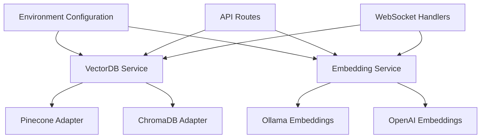

# ChromaDB/Ollama Integration Roadmap

## Overview
Implement optional ChromaDB vector store and Ollama embeddings to complement existing Pinecone/OpenAI infrastructure.

## Architecture Diagram

## Implementation Phases

### 1. Core Service Modularization
- Update vectorDbService.js with provider pattern
- Refactor embeddingService.js for multi-provider support
- Add environment validation in configService.js

### 2. ChromaDB Implementation
- Implement Chroma client (utils/chromadb.js)
- Collection management system
- Metadata filtering capabilities

### 3. Ollama Integration
- Ollama embedding client (utils/ollama.js)
- Fallback to OpenAI on Ollama unavailability
- Health check endpoints

### 4. Codebase Integration
- Update Pinecone initialization in server.js
- Modify WebSocket message handlers
- Refactor file processing pipeline

### 5. Validation & Testing
- Provider switching integration tests
- Docker-compose service definitions
- Operational documentation updates

## Key Files
- `server.js` - Provider initialization
- `utils/chromadb.js` - ChromaDB client
- `utils/ollama.js` - Embedding service
- `services/*Service.js` - Core service logic
- `docker-compose.yml` - Service dependencies

## Next Steps
1. Review service modularization approach
2. Implement ChromaDB client foundation
3. Add Ollama embedding support